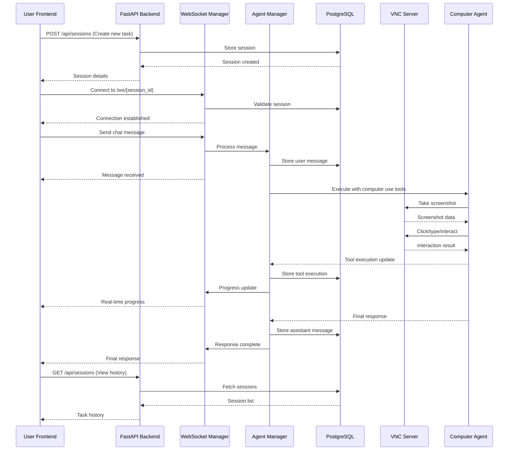

# Computer Use Session Backend

**Author: Dashgin Khudiyev**

A comprehensive backend API system for managing Claude Computer Use Agent sessions with real-time communication, VNC integration, and persistent storage. This project rebuilds the experimental Streamlit-based computer use demo into a robust FastAPI backend with session management capabilities.

## 🏗️ Architecture Overview

This system provides a **chat-like interface** where each task is treated as a **session** with full conversation history, real-time progress updates, and computer use integration.

### Core Components

- **FastAPI Backend**: RESTful APIs for session and message management
- **WebSocket Communication**: Real-time streaming of agent progress and tool execution
- **VNC Integration**: Live desktop environment access via noVNC
- **PostgreSQL Database**: Persistent storage for sessions, messages, and tool executions
- **Computer Use Agent**: Integration with Anthropic's computer use capabilities
- **Docker Environment**: Unified containerization for easy deployment

### Key Features

- 🔄 **Real-time Agent Communication**: Stream progress updates as the AI agent works
- 📋 **Session Management**: Create, manage, and persist chat sessions
- 🖥️ **VNC Desktop Access**: Watch the agent interact with applications in real-time
- 💾 **Full History Persistence**: All conversations and tool executions are stored
- 🔧 **Tool Execution Tracking**: Monitor each step of computer use operations
- 🌐 **WebSocket & REST APIs**: Dual communication methods for flexibility

## 🚀 Quick Start

### Prerequisites

- Docker 20.10+
- Docker Compose 2.0+
- Git
- At least 4GB RAM available

### Development Setup

1. **Clone**:
   ```bash
   git clone <repository-url>
   cd comp_use_agent
   ```

2. **Setup and Start services**:
   ```bash
   ./setup.sh
   ```

4. **Access the application**:
   - **Frontend UI**: http://localhost:8000
   - **API Documentation**: http://localhost:8000/docs
   - **VNC Desktop**: http://localhost:6080
   - **Health Check**: http://localhost:8000/health

### Production Deployment

```bash
docker-compose -f docker-compose.yml -f docker-compose.prod.yml up -d
```

## 📖 API Documentation

### Session Management

| Endpoint | Method | Description |
|----------|--------|-------------|
| `/api/sessions` | GET | List all sessions with pagination |
| `/api/sessions` | POST | Create a new session |
| `/api/sessions/{id}` | GET | Get session details |
| `/api/sessions/{id}` | PUT | Update session metadata |
| `/api/sessions/{id}` | DELETE | Delete a session |

### Message & Communication

| Endpoint | Method | Description |
|----------|--------|-------------|
| `/api/sessions/{id}/messages` | GET | Get session messages |
| `/api/sessions/{id}/messages` | POST | Send message to agent |
| `/ws/{session_id}` | WebSocket | Real-time communication |

### System Status

| Endpoint | Method | Description |
|----------|--------|-------------|
| `/health` | GET | System health check |
| `/api/vnc/status` | GET | VNC server status |
| `/api` | GET | API information |

### Complete API Reference

Visit http://localhost:8000/docs for interactive Swagger documentation with:
- Request/response schemas
- Authentication details  
- Example payloads
- Live testing interface

## 🔄 System Architecture



## 🛠️ Development Guide

### Local Development

```bash
# Install dependencies
pip install -r requirements-backend.txt
pip install -r dev-requirements.txt

# Run database migrations
alembic upgrade head

# Start development server
uvicorn app.main:app --reload --host 0.0.0.0 --port 8000
```


### Database Management

```bash
# Create new migration
alembic revision --autogenerate -m "description"

# Apply migrations
alembic upgrade head

# Reset database
alembic downgrade base && alembic upgrade head
```

## 📊 Performance & Monitoring

### Health Monitoring

The system provides comprehensive health checks:

```bash
curl http://localhost:8000/health
```

Returns status for:
- Database connectivity
- VNC server status  
- WebSocket manager
- Agent availability

## 🐳 Docker Configuration

### Services Overview

| Service | Port | Description |
|---------|------|-------------|
| `comp_use_service` | 8000, 6080, 5900 | Unified FastAPI + VNC container |
| `postgres` | 5432 | PostgreSQL database |

### Environment Variables

```bash
# Required
ANTHROPIC_API_KEY=your-api-key-here

# Optional
FASTAPI_ENV=development
LOG_LEVEL=info
DATABASE_URL=postgresql+asyncpg://...
```

### Data Persistence

- **Database**: PostgreSQL data in `postgres_data` volume
- **Logs**: Application logs in `comp_use_logs` volume
- **Sessions**: All chat history and tool executions persisted

### Code Standards

- **Python**: Follow PEP 8, use type hints
- **API**: RESTful design principles
- **Database**: Proper migrations and constraints
- **Docker**: Multi-stage builds and optimization
- **Testing**: Minimum 80% code coverage

## 🤝 Acknowledgments

- **Anthropic**: For the Computer Use capability and API
- **FastAPI**: For the excellent async web framework  
- **PostgreSQL**: For robust data persistence
- **Docker**: For containerization and deployment simplicity

---

## 🎯 Next Steps

1. **Set up your Anthropic API key** to enable full AI functionality
2. **Run the demo cases** to verify everything works correctly
3. **Explore the API documentation** at http://localhost:8000/docs
4. **Watch the agent work** via the VNC interface at http://localhost:6080
