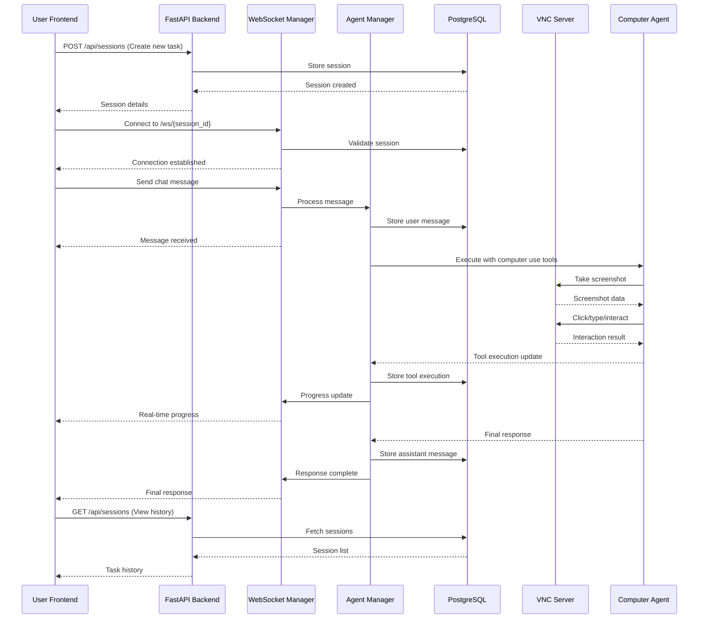

# Computer Use Session Backend

**Author: Dashgin Khudiyev**  
**Repository**: https://github.com/dashgin/comp_use_agent_task  
**Live Demo Video**: [VideoDemo.mp4](./VideoDemo.mp4)

A comprehensive backend API system for managing Claude Computer Use Agent sessions with real-time communication, VNC integration, and persistent storage. This project rebuilds the experimental Streamlit-based computer use demo into a robust FastAPI backend with session management capabilities.

## 🎬 Quick Links

- **📹 Live Demo Video**: [VideoDemo.mp4](./VideoDemo.mp4) - Complete walkthrough of all features
- **🚀 Quick Start**: [One-command setup](#quick-start) with `./setup.sh`
- **📚 API Documentation**: http://localhost:8000/docs (after setup)
- **🖥️ VNC Desktop**: http://localhost:6080 (watch the agent work)
- **📖 Complete Documentation**: [docs/](./docs/) directory
- **🐳 Docker Guide**: [docs/DOCKER_DEPLOYMENT.md](./docs/DOCKER_DEPLOYMENT.md)

## 🏗️ Architecture Overview

This system provides a **chat-like interface** where each task is treated as a **session** with full conversation history, real-time progress updates, and computer use integration.

### Core Components

- **FastAPI Backend**: RESTful APIs for session and message management
- **WebSocket Communication**: Real-time streaming of agent progress and tool execution
- **VNC Integration**: Live desktop environment access via noVNC
- **PostgreSQL Database**: Persistent storage for sessions, messages, and tool executions
- **Computer Use Agent**: Integration with Anthropic's computer use capabilities
- **Docker Environment**: Unified containerization for easy deployment

### Key Features

- 🔄 **Real-time Agent Communication**: Stream progress updates as the AI agent works
- 📋 **Session Management**: Create, manage, and persist chat sessions
- 🖥️ **VNC Desktop Access**: Watch the agent interact with applications in real-time
- 💾 **Full History Persistence**: All conversations and tool executions are stored
- 🔧 **Tool Execution Tracking**: Monitor each step of computer use operations
- 🌐 **WebSocket & REST APIs**: Dual communication methods for flexibility

## ✅ Challenge Requirements Compliance

This project fully addresses all requirements from the original challenge:

### ✅ Reused Existing Computer Use Agent Stack
- **Base**: Built on [Anthropic's computer-use-demo](https://github.com/anthropics/anthropic-quickstarts/tree/main/computer-use-demo)
- **Integration**: Complete integration of existing agent capabilities
- **Enhancement**: Added session management and persistence layer

### ✅ Replaced Streamlit with FastAPI Backend
- **Session Management APIs**: Complete CRUD operations for sessions
- **Real-time Streaming**: WebSocket-based progress updates
- **VNC Integration**: Live desktop environment access
- **Database Persistence**: PostgreSQL for chat history storage

### ✅ Docker Setup for Easy Deployment
- **Unified Container**: Single container with FastAPI + VNC environment
- **One-Command Setup**: `./setup.sh` for instant deployment
- **Multi-Environment**: Development and production configurations

### ✅ Simple Frontend Demonstration
- **Chat Interface**: Session-based conversation UI
- **Real-time Updates**: Live progress indicators
- **VNC Viewer**: Embedded desktop environment
- **API Integration**: Demonstrates all backend capabilities

## 🚀 Quick Start

### Prerequisites

- Docker 20.10+
- Docker Compose 2.0+
- Git
- At least 4GB RAM available

### One-Command Setup

1. **Clone and Setup**:
   ```bash
   git clone https://github.com/dashgin/comp_use_agent_task.git
   cd comp_use_agent_task
   ./setup.sh
   ```

2. **Access the application**:
   - **Frontend UI**: http://localhost:8000
   - **API Documentation**: http://localhost:8000/docs
   - **VNC Desktop**: http://localhost:6080
   - **Health Check**: http://localhost:8000/health

### Manual Setup (Alternative)

```bash
# Set your Anthropic API key
export ANTHROPIC_API_KEY="your-api-key-here"

# Start services
docker-compose up -d

# Check status
docker-compose ps
```

### Production Deployment

```bash
docker-compose -f docker-compose.yml -f docker-compose.prod.yml up -d
```

## 📖 API Documentation

### Session Management

| Endpoint | Method | Description |
|----------|--------|-------------|
| `/api/sessions` | GET | List all sessions with pagination |
| `/api/sessions` | POST | Create a new session |
| `/api/sessions/{id}` | GET | Get session details |
| `/api/sessions/{id}` | PUT | Update session metadata |
| `/api/sessions/{id}` | DELETE | Delete a session |

### Message & Communication

| Endpoint | Method | Description |
|----------|--------|-------------|
| `/api/sessions/{id}/messages` | GET | Get session messages |
| `/api/sessions/{id}/messages` | POST | Send message to agent |
| `/ws/{session_id}` | WebSocket | Real-time communication |

### System Status

| Endpoint | Method | Description |
|----------|--------|-------------|
| `/health` | GET | System health check |
| `/api/vnc/status` | GET | VNC server status |
| `/api` | GET | API information |

### Complete API Reference

Visit http://localhost:8000/docs for interactive Swagger documentation with:
- Request/response schemas
- Authentication details  
- Example payloads
- Live testing interface

## 🔄 System Architecture



## 🛠️ Development Guide

### Local Development

```bash
# Install dependencies
pip install -r requirements-backend.txt
pip install -r dev-requirements.txt

# Run database migrations
alembic upgrade head

# Start development server
uvicorn app.main:app --reload --host 0.0.0.0 --port 8000
```


### Database Management

```bash
# Create new migration
alembic revision --autogenerate -m "description"

# Apply migrations
alembic upgrade head

# Reset database
alembic downgrade base && alembic upgrade head
```

## 📊 Performance & Monitoring

### Health Monitoring

The system provides comprehensive health checks:

```bash
curl http://localhost:8000/health
```

Returns status for:
- Database connectivity
- VNC server status  
- WebSocket manager
- Agent availability

## 🐳 Docker Configuration

### Services Overview

| Service | Port | Description |
|---------|------|-------------|
| `comp_use_service` | 8000, 6080, 5900 | Unified FastAPI + VNC container |
| `postgres` | 5432 | PostgreSQL database |

### Environment Variables

```bash
# Required
ANTHROPIC_API_KEY=your-api-key-here

# Optional
FASTAPI_ENV=development
LOG_LEVEL=info
DATABASE_URL=postgresql+asyncpg://...
```

### Data Persistence

- **Database**: PostgreSQL data in `postgres_data` volume
- **Logs**: Application logs in `comp_use_logs` volume
- **Sessions**: All chat history and tool executions persisted

### Code Standards

- **Python**: Follow PEP 8, use type hints
- **API**: RESTful design principles
- **Database**: Proper migrations and constraints
- **Docker**: Multi-stage builds and optimization
- **Testing**: Minimum 80% code coverage

## 🤝 Acknowledgments

- **Anthropic**: For the Computer Use capability and API
- **FastAPI**: For the excellent async web framework  
- **PostgreSQL**: For robust data persistence
- **Docker**: For containerization and deployment simplicity

---

## 📁 Project Structure

```
comp_use_agent_task/
├── 📹 VideoDemo.mp4              # Live demo video
├── 🚀 setup.sh                  # One-command setup script
├── 📋 DELIVERABLES.md           # Complete project deliverables
├── 🐳 docker-compose.yml       # Docker services configuration
├── 📦 Dockerfile               # Unified container build
├── 🔧 requirements-backend.txt # Python dependencies
├── 📚 docs/                    # Complete documentation
│   ├── API_ENDPOINTS_SUMMARY.md
│   ├── DOCKER_DEPLOYMENT.md
│   ├── DATABASE_ERD_ANALYSIS.md
│   └── README.md
├── 🖥️ app/                     # FastAPI backend
│   ├── api/                    # REST API endpoints
│   ├── core/                   # Business logic
│   ├── models/                 # Database models
│   ├── db/                     # Database utilities
│   └── static/                 # Frontend files
├── 🤖 computer_use_demo/       # Anthropic agent integration
└── 🗄️ alembic/                 # Database migrations
```

## 🎯 Getting Started Guide

### 1. Watch the Demo Video
Start by watching [VideoDemo.mp4](./VideoDemo.mp4) to see all features in action.

### 2. Quick Setup
```bash
git clone https://github.com/dashgin/comp_use_agent_task.git
cd comp_use_agent_task
./setup.sh
```

### 3. Explore the APIs
Visit http://localhost:8000/docs for interactive API documentation.

### 4. Try the Frontend
Use the chat interface at http://localhost:8000 to interact with the agent.

### 5. Watch the Agent Work
Monitor real-time agent actions at http://localhost:6080 (VNC viewer).

## 📖 Documentation Links

- **📋 [Project Deliverables](./DELIVERABLES.md)** - Complete requirements compliance
- **🎬 [Demo Video Guide](./DEMO_VIDEO.md)** - Recording instructions and content
- **🌐 [API Reference](./docs/API_ENDPOINTS_SUMMARY.md)** - Complete endpoint documentation
- **🐳 [Docker Deployment](./docs/DOCKER_DEPLOYMENT.md)** - Deployment and scaling guide
- **🗄️ [Database Schema](./docs/DATABASE_ERD_ANALYSIS.md)** - Database design and analysis
- **📚 [Full Documentation](./docs/README.md)** - Documentation index

## 🔗 Important Links

- **GitHub Repository**: https://github.com/dashgin/comp_use_agent_task
- **Original Anthropic Demo**: https://github.com/anthropics/anthropic-quickstarts/tree/main/computer-use-demo
- **Live Demo Video**: [VideoDemo.mp4](./VideoDemo.mp4)
- **API Documentation**: http://localhost:8000/docs (after setup)
- **Frontend Interface**: http://localhost:8000 (after setup)
- **VNC Desktop**: http://localhost:6080 (after setup)
