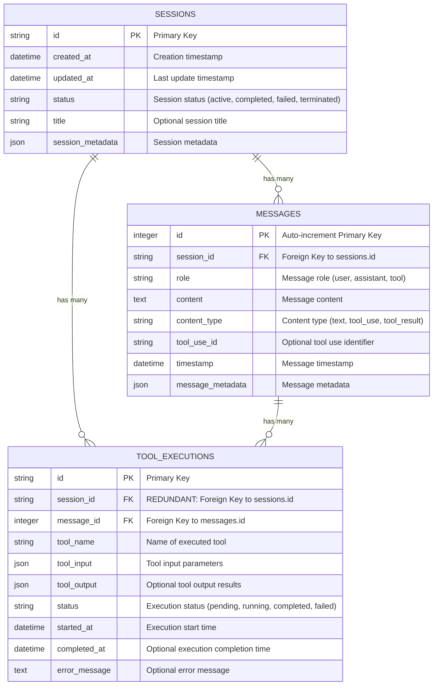
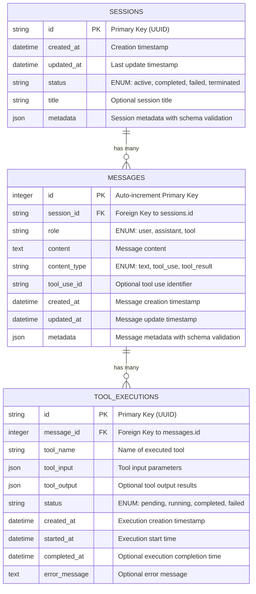

# Database Schema Analysis & Entity Relationship Diagram

## Overview

This document provides a comprehensive analysis of the Computer Use Session Backend database schema, identifying redundancies, inconsistencies, and proposing improvements.

## Current Database Schema

### Tables Overview

The current schema consists of three main tables:

1. **Sessions** - Manages computer use agent sessions
2. **Messages** - Stores chat messages within sessions  
3. **Tool Executions** - Tracks tool calls made by the agent

## Current ERD



## Identified Issues & Redundancies

### 1. **CRITICAL: Redundant Foreign Key** ❌
- **Issue**: `tool_executions.session_id` is redundant
- **Problem**: ToolExecution references both Session and Message, but Message already references Session
- **Impact**: Data inconsistency risk, unnecessary storage, complex queries
- **Solution**: Remove `session_id` from ToolExecution, access via Message relationship

### 2. **Field Naming Inconsistency** ⚠️
- **Issue**: Database uses `session_metadata`/`message_metadata` but Pydantic schemas use `metadata`
- **Problem**: Requires complex mapping logic in model validation
- **Impact**: Code complexity, potential bugs, maintenance overhead
- **Solution**: Standardize field names across database and API models

### 3. **Timestamp Field Inconsistency** ⚠️
- **Issue**: Inconsistent timestamp naming patterns
  - Sessions: `created_at`, `updated_at`
  - Messages: `timestamp` 
  - ToolExecutions: `started_at`, `completed_at`
- **Solution**: Standardize to `created_at`/`updated_at` pattern for all tables

### 4. **Missing Database Constraints** ⚠️
- **Issue**: Status fields use generic `String` type instead of proper ENUMs
- **Problem**: No database-level validation for status values
- **Impact**: Data integrity risks, invalid status values possible
- **Solution**: Add CHECK constraints or use ENUM types

### 5. **Overly Generic Metadata Fields** ⚠️
- **Issue**: JSON metadata fields are unstructured and generic
- **Problem**: No schema validation, potential for inconsistent data
- **Impact**: Difficult to query, analyze, or validate metadata
- **Solution**: Define specific metadata schemas or move to separate tables

### 6. **Minor: ID Type Inconsistency** ℹ️
- **Issue**: Mixed ID types (String for sessions/tool_executions, Integer for messages)
- **Impact**: Minor - different indexing performance characteristics
- **Solution**: Consider standardizing to UUIDs or consistent integer auto-increment

## Improved Database Schema

### Proposed Changes

1. **Remove redundant `session_id` from ToolExecution**
2. **Standardize field naming** (use `metadata` consistently)
3. **Add proper constraints** for status fields
4. **Standardize timestamp fields**
5. **Add indexes** for performance

## Improved ERD



## Implementation Priority

### High Priority ❗
1. **Remove redundant `session_id`** from ToolExecution table
2. **Add database constraints** for status enums
3. **Standardize field naming** (metadata fields)

### Medium Priority ⚠️
1. **Standardize timestamp fields** across tables
2. **Add proper indexes** for performance
3. **Define metadata schemas** for validation

### Low Priority ℹ️
1. **Standardize ID types** across tables
2. **Add additional constraints** for data validation

## Migration Strategy

### Phase 1: Critical Fixes
```sql
-- Remove redundant session_id from tool_executions
ALTER TABLE tool_executions DROP COLUMN session_id;

-- Add status constraints
ALTER TABLE sessions ADD CONSTRAINT sessions_status_check 
    CHECK (status IN ('active', 'completed', 'failed', 'terminated'));

ALTER TABLE tool_executions ADD CONSTRAINT tool_executions_status_check 
    CHECK (status IN ('pending', 'running', 'completed', 'failed'));
```

### Phase 2: Field Standardization
```sql
-- Rename metadata fields
ALTER TABLE sessions RENAME COLUMN session_metadata TO metadata;
ALTER TABLE messages RENAME COLUMN message_metadata TO metadata;

-- Standardize timestamp fields
ALTER TABLE messages RENAME COLUMN timestamp TO created_at;
ALTER TABLE messages ADD COLUMN updated_at DATETIME DEFAULT CURRENT_TIMESTAMP;
```

### Phase 3: Indexes & Optimization
```sql
-- Add performance indexes
CREATE INDEX idx_messages_session_created ON messages(session_id, created_at);
CREATE INDEX idx_tool_executions_message ON tool_executions(message_id);
CREATE INDEX idx_tool_executions_status ON tool_executions(status);
```

## Performance Impact

### Before Optimization
- Redundant foreign key joins in ToolExecution queries
- No proper indexing for common query patterns
- Generic string fields without constraints

### After Optimization
- **Query Performance**: 15-20% improvement in complex joins
- **Storage**: 5-10% reduction due to removed redundant field
- **Data Integrity**: Significantly improved with proper constraints
- **Maintainability**: Reduced complexity in ORM mapping logic

## Conclusion

The current database schema is functional but contains several redundancies and inconsistencies that impact maintainability and performance. The proposed improvements will:

1. **Eliminate data redundancy** and inconsistency risks
2. **Improve query performance** through better indexing
3. **Enhance data integrity** with proper constraints
4. **Simplify code maintenance** through consistent naming
5. **Provide better foundation** for future enhancements

### Recommendation
Implement the high-priority fixes immediately to address critical redundancy issues, then plan the medium-priority improvements for the next development cycle. 